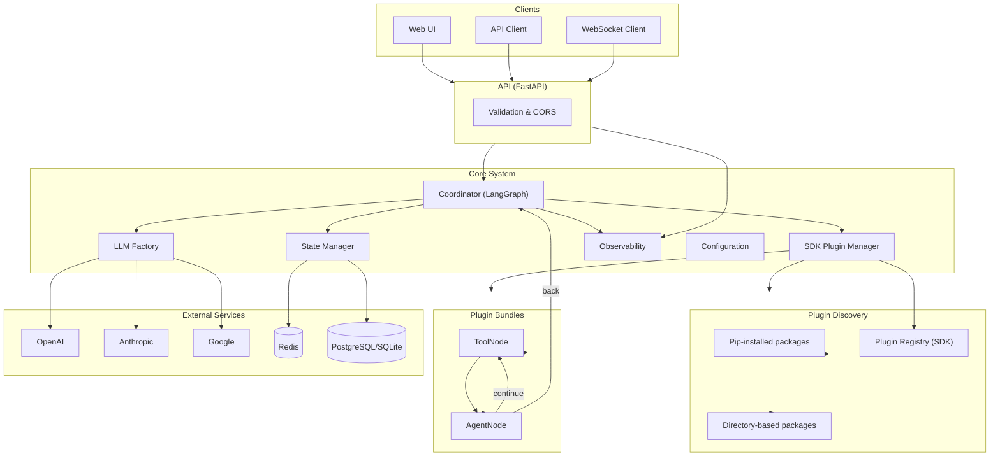
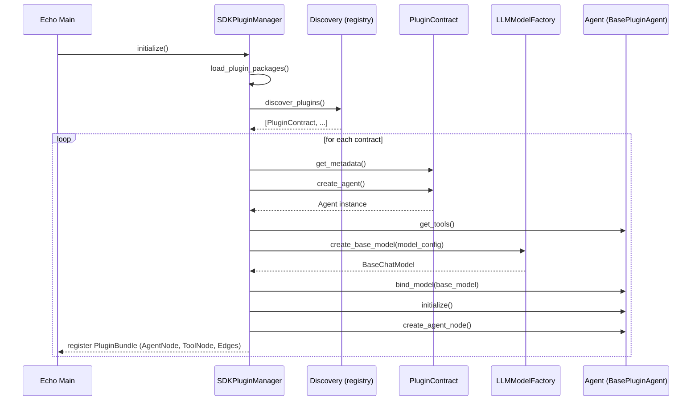
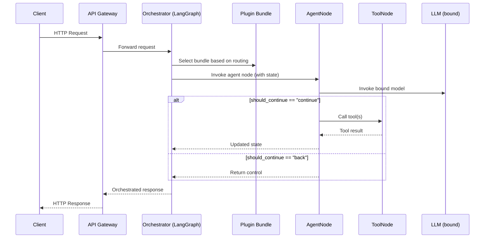
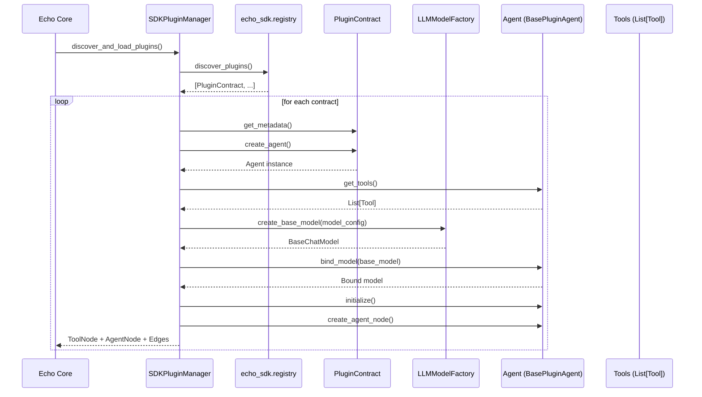
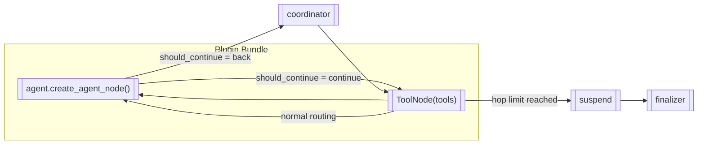
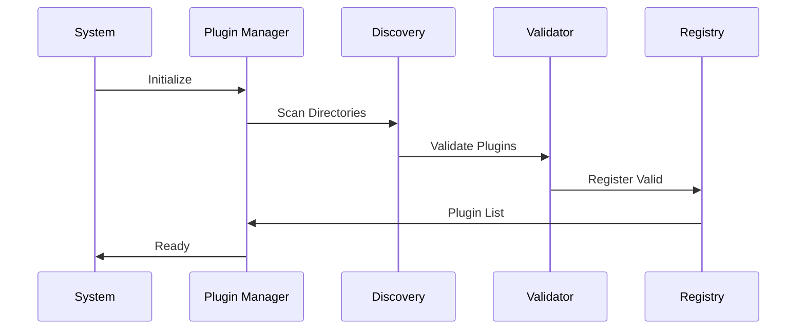

# Architecture Overview

Echo is built with a modular, plugin-driven architecture that emphasizes simplicity, extensibility, and production
readiness. This document explains the core architectural decisions and how the system components interact.

## High-Level Architecture



## Core Components

### 1. **API (FastAPI)**

The entry point for all external communication:

- **REST API**: HTTP endpoints for synchronous operations
- WebSocket support is not implemented in this version
- Authentication and rate limiting are not included by default
- **CORS**: Cross-origin resource sharing configuration
- **Validation**: Request/response validation with Pydantic

### 2. **Multi-Agent Orchestrator**

The brain of the system that coordinates agent interactions:

- **Workflow Management**: LangGraph-based workflow orchestration
- **Agent Routing**: Intelligent routing to appropriate agents with hop limit handling
- **State Management**: Persistent conversation and workflow state
- **Error Handling**: Graceful failure recovery and fallbacks
- **Performance Optimization**: Caching and resource management
- **Suspend Node**: Intelligent handling of hop limits with AI communication

### 3. **Plugin Manager**

Handles the complete plugin lifecycle:

- **Discovery**: Automatic plugin detection and loading
- **Validation**: Plugin structure and dependency verification
- **Lifecycle Management**: Loading, unloading, and hot-reloading
- **Resource Management**: Memory and connection pooling
- **Health Monitoring**: Plugin status and performance metrics

### 4. **LLM Factory**

Manages connections to various language models:

- **Provider Abstraction**: Unified interface for different LLM providers
- **Model Caching**: Intelligent caching of model instances
- **Configuration Management**: Provider-specific settings and parameters
- **Fallback Handling**: Automatic failover between providers
- **Cost Optimization**: Token usage tracking and optimization

## Data Flow

### Plugin Discovery Sources

Echo aggregates plugins from two sources at startup:

- Pip-installed packages (environment packages)
    - Discovered via the SDK registry when packages that depend on `echo_sdk` are present
    - Import of the package triggers `register_plugin(...)`
    - No extra configuration needed beyond having the package installed

- Directory-based packages (filesystem)
    - Controlled via environment variable `ECHO_PLUGINS_DIR`

```bash
# Single directory
ECHO_PLUGINS_DIR=./plugins/src/echo_plugins

# Or JSON list of directories
ECHO_PLUGINS_DIR=["/abs/path/one", "/abs/path/two"]
```

Requirements for directory discovery:

- Each entry is a valid Python package (has `__init__.py`)
- The package imports call `register_plugin(MyPlugin)` so the SDK registry can collect it

### Application Startup Flow (performed once at app start)



### Request Processing Flow (uses preloaded bundles)



### Agent-as-Plugin Integration with LangGraph (startup)

This section explains precisely how a plugin becomes executable nodes in the LangGraph workflow.



At run-time the orchestrator uses the pre-wired nodes and edges like this:



Key responsibilities:

- Agent.get_tools(): returns LangChain Tools used by the agent
- Agent.bind_model(): binds tools to the chat model (model.bind_tools(tools))
- Agent.create_agent_node(): returns the callable used as the LangGraph node
- Agent.should_continue(state): returns "continue" to call tools or "back" to return to the coordinator

#### Suspend Node for Hop Limit Handling

The suspend node provides intelligent handling of hop limits:

- **Intercepts** when `max_agent_hops` is reached
- **Informs the AI** about the limit situation with context
- **Allows AI response** before finalization
- **Improves user experience** by explaining why processing stopped
- **Preserves context** across the limit boundary

When hop limits are reached, the workflow automatically routes through:
`ToolNode → SuspendNode → Finalizer → END`

This ensures the AI can communicate with users about incomplete processing and provide helpful context.

#### Core Wiring (excerpt)

The following excerpt (simplified) shows bundle creation and graph plumbing:

```python
# src/echo/infrastructure/plugins/sdk_manager.py (excerpt)
def discover_and_load_plugins(self) -> None:
    self.load_plugin_packages()
    contracts = discover_plugins()
    for contract in contracts:
        self._create_plugin_bundle(contract)


def _create_plugin_bundle(self, contract: PluginContract) -> bool:
    metadata = contract.get_metadata()
    agent = contract.create_agent()
    base_model = self.llm_factory.create_base_model(
        self._create_model_config(metadata)
    )
    tools = agent.get_tools()
    bound_model = agent.bind_model(base_model)
    agent.initialize()
    bundle = SDKPluginBundle(
        contract=contract,
        agent=agent,
        bound_model=bound_model,
        tools=tools,
    )
    # bundle.tool_node and bundle.agent_node are then registered in the graph
    return True
```

This is where tools, the bound model, and the agent node are produced and attached to the graph.

### Plugin Loading Flow



## Design Principles

### 1. **Separation of Concerns**

Each component has a single, well-defined responsibility:

- **API Gateway**: Handles HTTP concerns only
- **Orchestrator**: Manages workflow logic only
- **Plugin Manager**: Handles plugin lifecycle only
- **LLM Factory**: Manages model connections only

### 2. **Plugin-First Architecture**

Everything is a plugin, enabling:

- **Extensibility**: Add new capabilities without code changes
- **Modularity**: Independent development and deployment
- **Maintainability**: Isolated testing and debugging
- **Scalability**: Horizontal scaling of specific capabilities

### 3. **Configuration-Driven**

System behavior is controlled through:

- **Environment Variables**: Runtime configuration
- **Plugin Metadata**: Capability declarations
- **Dynamic Settings**: Runtime parameter adjustment
- **Validation**: Configuration integrity checks

### 4. **Production Ready**

Built-in features for production deployment:

- **Health Checks**: Comprehensive system monitoring
- **Logging**: Structured logging with configurable levels
- **Metrics**: Performance and usage metrics
- **Error Handling**: Graceful degradation and recovery

## Technical Stack

### Backend Framework

- **FastAPI**: Modern, fast web framework for APIs
- **Pydantic**: Data validation and settings management
- **Uvicorn**: ASGI server for production deployment

### AI/ML Stack

- **LangChain**: LLM application framework
- **LangGraph**: Workflow orchestration
- **OpenAI/Anthropic/Google**: LLM provider APIs

### Data Management

- **Redis**: Caching and session storage
- **SQLite/PostgreSQL**: Persistent data storage
- **Pydantic**: Data models and validation

### Development Tools

- **Poetry**: Dependency management
- **Pytest**: Testing framework
- **Black/Isort**: Code formatting
- **MyPy**: Type checking

## Scalability Considerations

### Horizontal Scaling

- **Stateless Design**: API components can be replicated
- **Plugin Isolation**: Plugins run independently
- **Load Balancing**: Multiple instances can share load
- **Database Sharding**: Data can be distributed

### Performance Optimization

- **Connection Pooling**: Efficient resource management
- **Caching Layers**: Multiple levels of caching
- **Async Operations**: Non-blocking I/O operations
- **Resource Limits**: Configurable resource constraints

### Monitoring and Observability

- **Health Endpoints**: System status monitoring
- **Metrics Collection**: Performance data gathering
- **Log Aggregation**: Centralized log management
- **Tracing**: Request flow tracking

## Security Architecture

### Authentication & Authorization

- **JWT Tokens**: Stateless authentication
- **Role-Based Access**: Granular permission control
- **API Key Management**: Secure credential storage
- **Rate Limiting**: Abuse prevention

### Data Protection

- **Input Validation**: Comprehensive input sanitization
- **Output Encoding**: Safe data presentation
- **Encryption**: Data in transit and at rest
- **Audit Logging**: Security event tracking

## Performance Characteristics

### Response Times

- **Simple Queries**: < 100ms
- **LLM Processing**: 1-5 seconds (provider dependent)
- **Plugin Operations**: < 500ms
- **Complex Workflows**: 5-30 seconds

### Throughput

- **Concurrent Users**: 100+ simultaneous users
- **Requests/Second**: 1000+ RPS (depending on complexity)
- **Plugin Instances**: Configurable per plugin
- **Memory Usage**: 100MB-2GB (depending on plugins)

## Future Architecture

### Planned Enhancements

- **Microservices**: Service decomposition for scale
- **Event Streaming**: Real-time event processing
- **GraphQL**: Flexible query interface
- **Kubernetes**: Container orchestration
- **Service Mesh**: Inter-service communication

### Extension Points

- **Custom Orchestrators**: Alternative workflow engines
- **Plugin Marketplaces**: Third-party plugin distribution
- **Multi-Tenancy**: Isolated user environments
- **Federation**: Distributed Echo instances

## Related Documentation

- **[Plugin System](plugin-system.md)** - Plugin architecture details
- **[Deployment](../deployment/production.md)** - Production setup
