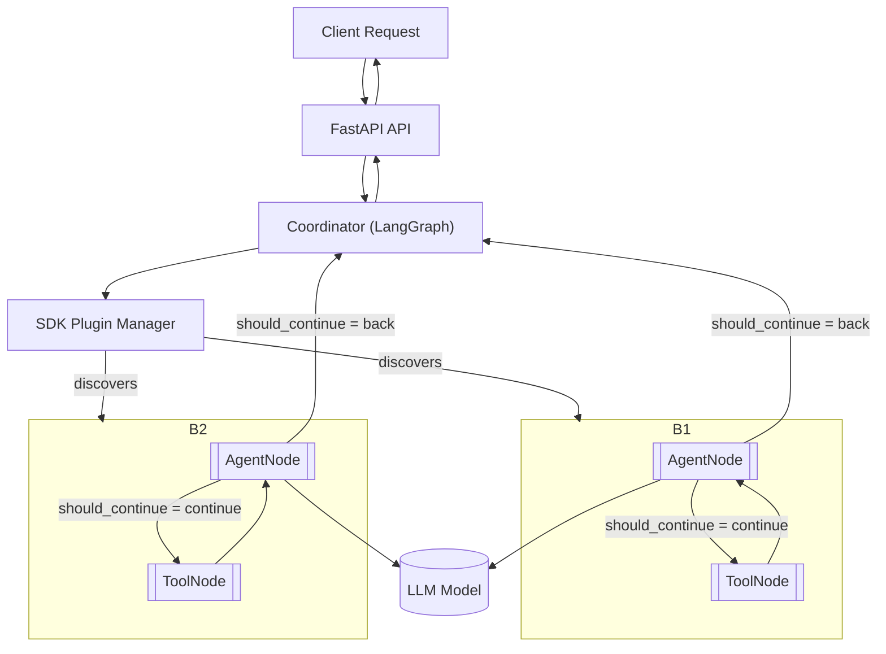

# Echo 🤖 Multi-agents AI Framework

Welcome to Echo — a powerful, open-source multi-agent orchestration system designed to simplify the development and deployment of AI agent workflows.

- **Quick Start**: [Get up and running](getting-started/quick-start.md)
- **Core Concepts**: [Understand the architecture](concepts/architecture.md)
- **Plugin Development**: [Build custom agents](plugins/overview.md)
- **Deployment**: [Configure environments](deployment/environment.md)

---

## What is Echo?

Echo is a multi-agent orchestration framework built with modern Python technologies like LangChain and LangGraph. It provides a robust foundation for creating intelligent, collaborative AI systems, and a clean plugin system that keeps your core code decoupled from custom functionality.

## Philosophy

Echo is built on three core principles:

### 1. Simplicity First

- Clean, intuitive APIs that get out of your way
- Minimal boilerplate code for maximum productivity
- Clear separation of concerns between core system and plugins

### 2. Plugin-Driven Architecture

- Everything is a plugin — from agents to tools
- Hot-reloadable plugins for rapid development
- True decoupling between core system and custom functionality

### 3. Production Ready

- Built for scale with enterprise-grade reliability
- Comprehensive monitoring and observability
- Docker support and cloud-native deployment

## Architecture Overview



## Key Features

- **Multi-Agent Orchestration**: Coordinate multiple AI agents in complex workflows
- **Plugin System**: Extend functionality without touching core code
- **Hot Reloading**: Update plugins without restarting the system
- **LLM Agnostic**: Support for OpenAI, Anthropic, Google, and more
- **REST API**: Full HTTP API for integration with any system
- **Operational API**: Endpoints for chat, plugins, status, and health
- **Comprehensive Logging**: Built-in observability and debugging tools

## Quick Example

```python
from echo_sdk import BasePlugin, PluginMetadata, BasePluginAgent


class MyPlugin(BasePlugin):
    @staticmethod
    def get_metadata() -> PluginMetadata:
        return PluginMetadata(
            name="my_agent",
            version="0.1.0",
            description="My custom AI agent",
            capabilities=["custom_task"],
        )

    @staticmethod
    def create_agent() -> BasePluginAgent:
        return MyAgent(MyPlugin.get_metadata())


class MyAgent(BasePluginAgent):
    def get_tools(self):
        return [my_custom_tool]

    def get_system_prompt(self):
        return "You are a helpful AI assistant."
```

## What's Next?

- [Quick Start Guide](getting-started/quick-start.md) — Get Echo running in 5 minutes
- [Plugin Development](plugins/overview.md) — Learn to build custom agents
- [Architecture](concepts/architecture.md) — Understand the system design
- [Environment](deployment/environment.md) — Configure your setup

## Contributing

Echo is open source and welcomes contributions! Check out the [contributing guide](contributing/development.md) to get started.

## License

Echo is licensed under the MIT License — see the [LICENSE](../LICENSE) file for details.

---

Made with Material for MkDocs
