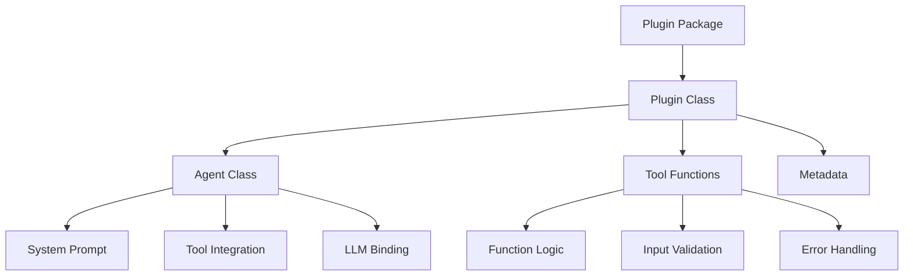
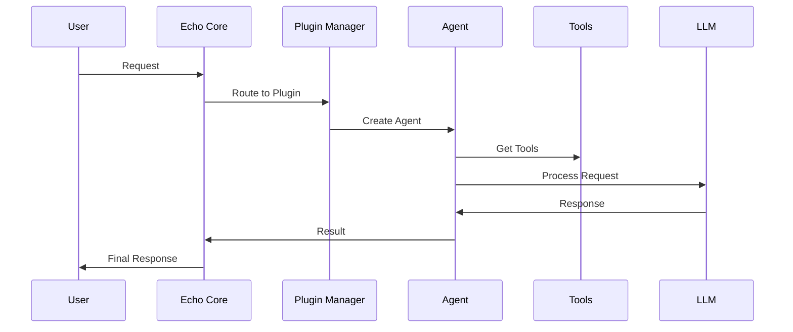

# Plugin Development Overview

Echo's plugin system is the heart of its extensibility. This guide explains how plugins work, their architecture, and
how to create your own.

## What is a Plugin?

A **plugin** in Echo is a self-contained module that provides:

- **AI Agents**: Specialized AI assistants with specific capabilities
- **Tools**: Functions that agents can use to perform tasks
- **Metadata**: Information about the plugin's purpose and requirements
- **Configuration**: Settings and parameters for customization

## Plugin Architecture



## Plugin Structure

Every Echo plugin follows this structure:

```
my_plugin/
├── __init__.py          # Plugin registration
├── plugin.py            # Main plugin class
├── agent.py             # Agent implementation
├── tools.py             # Tool functions
├── pyproject.toml       # Package configuration
└── README.md            # Documentation
```

## Core Components

### 1. Plugin Class

The main entry point that defines:

- Plugin metadata (name, version, description)
- Agent creation factory method
- Dependency validation
- Configuration schema

### 2. Agent Class

Implements the AI agent behavior:

- System prompt for LLM interaction
- Tool integration and management
- State management and decision making
- LLM model binding

### 3. Tools

Functions that agents can call:

- Input validation and processing
- External API integration
- Data transformation
- Error handling and logging

## Plugin Lifecycle



## Plugin Requirements

### Required Methods

Every plugin must implement:

- `get_metadata()` - Return plugin information
- `create_agent()` - Create agent instance

### Required Agent Methods

Every agent must implement:

- `get_tools()` - Return available tools
- `get_system_prompt()` - Define agent behavior
- `bind_model()` - Connect to LLM
- `initialize()` - Setup resources
- `create_agent_node()` - LangGraph integration
- `should_continue()` - Workflow control

## Plugin Types

### 1. **Specialized Agents**

- Focus on specific domains (math, search, analysis)
- Limited but powerful tool sets
- Optimized for particular tasks

### 2. **General Agents**

- Broad capabilities across multiple domains
- Extensive tool collections
- Flexible but potentially less focused

### 3. **Utility Agents**

- Support and coordination functions
- System management and monitoring
- Workflow orchestration

## Plugin Discovery

Echo automatically discovers plugins through:

1. **Directory Scanning**: Looks in configured plugin directories
2. **Package Import**: Imports plugin modules
3. **Auto-registration**: Registers discovered plugins
4. **Validation**: Checks plugin structure and dependencies

## Plugin Metadata

Essential information for each plugin:

```python
PluginMetadata(
    name="my_agent",
    version="0.1.0",
    description="Description of what this agent does",
    capabilities=["capability1", "capability2"],
    llm_requirements={
        "provider": "openai",
        "model": "gpt-4",
        "temperature": 0.1,
        "max_tokens": 1024
    },
    agent_type="specialized",
    dependencies=["external-package>=0.1.0"],
    
)
```

## Development Workflow

### 1. **Design Phase**

- Define agent purpose and capabilities
- Plan required tools and integrations
- Design system prompt and behavior

### 2. **Implementation Phase**

- Create plugin structure
- Implement agent logic
- Develop tool functions
- Add error handling

### 3. **Testing Phase**

- Unit test individual components
- Integration test with Echo core
- Validate plugin behavior
- Performance testing

### 4. **Deployment Phase**

- Package plugin for distribution
- Deploy to plugin directory
- Monitor plugin health
- Gather user feedback

## Security Considerations

- **Input Validation**: Always validate user inputs
- **API Key Management**: Secure external service credentials
- **Rate Limiting**: Prevent abuse of external APIs
- **Error Handling**: Don't expose sensitive information
- **Dependency Scanning**: Regular security updates

## Best Practices

### Code Quality

- Follow Python best practices (PEP 8)
- Comprehensive error handling
- Clear documentation and comments
- Type hints for better IDE support

### Performance

- Efficient tool implementations
- Proper resource management
- Caching where appropriate
- Async operations for I/O-bound tasks

### Maintainability

- Modular design
- Clear separation of concerns
- Comprehensive testing
- Version management

## Next Steps

Ready to build your first plugin? Continue with:

- **[Creating Your First Plugin](first-plugin.md)** - Step-by-step tutorial
- Explore the code of existing plugins for deeper patterns

## Examples

Examples in this repository:

- Math plugin: `plugins/src/echo_plugins/math_agent/`
- Search plugin: `plugins/src/echo_plugins/search_agent/`

## Getting Help

- Review plugin validation in `sdk/src/echo_sdk/utils/validation.py`
- Explore SDK base classes in `sdk/src/echo_sdk/base/`
- Join our community discussions
